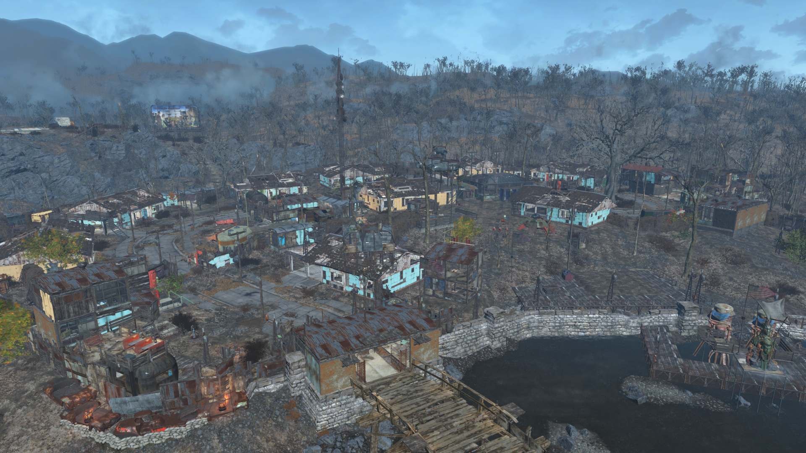
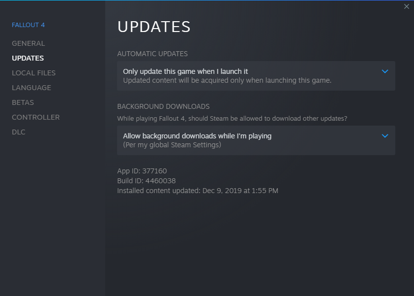
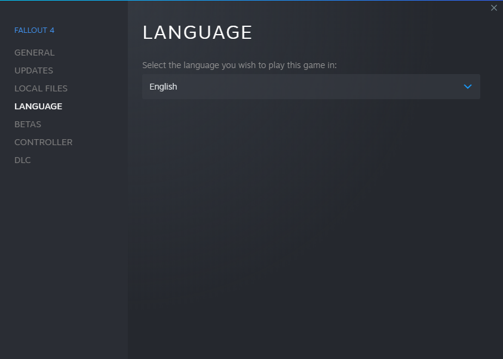
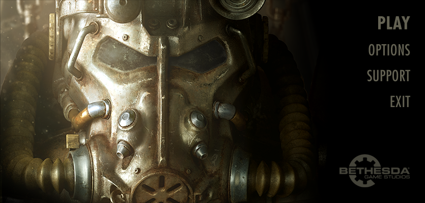
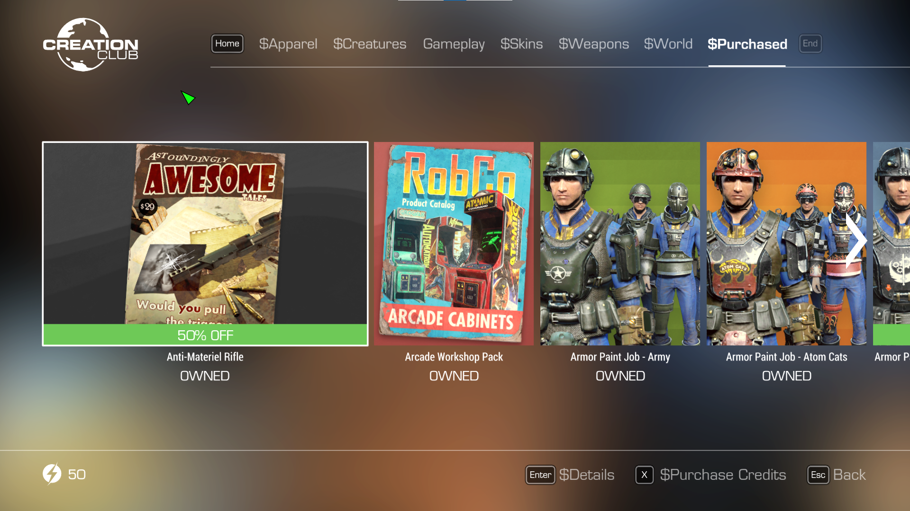

# Yagisan's SimSettlements 2 City Plan Contest Helper

Yagisan's SimSettlements 2 City Plan Contest Helper is a curated modlist specifically designed for entrants in the SimSettlements 2 City Plan contest. It is a private project by Yagisan, and is in no way, shape, or form, endorsed by the rest of the SimSettlements team.

Its purpose is to ensure that all contest entries are valid, and that entrants can use plots from all known working addons.

It contains F4SE, Buffout 4 and several other F4SE based bugfixes and useful building utilities. In addition it contains the UFO4P, SimSettlements 2, all of its dependencies, and finally it contains all SimSettlements 2 addon packs that are known to be actively maintained and with cooperative authors.

**This list will coexist with your existing installation.**

 |  |  |  |
| - | - | - |

- [Yagisan's SimSettlements 2 City Plan Contest Helper](#yagisans-simsettlements-2-city-plan-contest-helper)
- [Preamble](#preamble)
- [Quick Links](#quick-links)
- [Installation](#installation)
  - [Pre-Installation](#pre-installation)
    - [Installing Microsoft Visual C++ Redistributable Package](#installing-microsoft-visual-c-redistributable-package)
    - [Steam Config](#steam-config)
      - [Disable the Steam Overlay](#disable-the-steam-overlay)
      - [Change Steams Update Behaviour](#change-steams-update-behaviour)
      - [Set the Game language to English](#set-the-game-language-to-english)
    - [Reverting a "cleaned" Fallout 4](#reverting-a-cleaned-fallout-4)
      - [Start Fallout 4](#start-fallout-4)
      - [Creation Club](#creation-club)
    - [Using Wabbajack](#using-wabbajack)
      - [Preparations](#preparations)
      - [Downloading and Installing](#downloading-and-installing)
      - [Problems with Wabbajack](#problems-with-wabbajack)
  - [Post-Installation](#post-installation)
- [Starting the Game](#starting-the-game)
- [Updating](#updating)
- [Starting the game](#starting-the-game-1)
- [Other Post Installation FAQ](#other-post-installation-faq)
  - [Removing the Modlist](#removing-the-modlist)
  - [Contact and Technical Support](#contact-and-technical-support)

# Preamble

The purpose of this modlist is to ensure that all contest entries are valid, and that entrants can use plots from all known working addons. **It is not a substitute for reading and understanding the contest rules as posted in the SimSettlements 2 forums.**

**In the event of a discrepancy between this modlist, and the posted contest rules, the contest rules as posted in the SimSettlements 2 forums are considered correct.**

# Quick Links

- [Patreon](https://patreon.com/yagisan) contains update posts and provides a way of showing support for the project.
- [Ko-fi](https://ko-fi.com/yagisan) contains update posts and provides a way of showing support for the project.
- [Downloads](https://github.com/Yagisan/SS2-City-Plan-Contest-Helper/releases) for the most recent releases.
- [Wabbajack](https://github.com/wabbajack-tools/wabbajack/releases) for the tool to install this modlist.
- [Issues](https://github.com/Yagisan/SS2-City-Plan-Contest-Helper/issues) for technical support with this mod list.
- [Discord](https://discord.gg/rB5RFgHhUD) for community support with the mod list.

# Installation

## Pre-Installation

These steps are only needed if you install this Modlist for the first time. If you update the Modlist, jump straight to [Updating](#updating).

### Installing Microsoft Visual C++ Redistributable Package

It is unlikely that you are missing this. However it is needed for MO2 and several plugins, so please download it and install it anyway from [Microsoft](https://support.microsoft.com/en-us/help/2977003/the-latest-supported-visual-c-downloads). Download the x64 version under "Visual Studio 2015, 2017 and 2019". This is [Direct link](https://aka.ms/vs/16/release/vc_redist.x64.exe) if you can't find it.

### Steam Config

#### Disable the Steam Overlay

The Steam Overlay can cause issues with ENB and is recommended to be turned off.
**Please note that this mod list does not use an ENB.**

Open the Properties window (right click the game in your Library->Properties), navigate to the _General_ tab and un-tick the _Enable the Steam Overlay while in-game_ checkbox. You should also un-tick the _Keep games saves in the Steam Cloud_.

#### Change Steams Update Behaviour

Fallout 4 is still being updated by Bethesda (they only add Creation Club content). Whenever the game updates, the entire modding community goes silent for the next one or two weeks because some mods need to be updated to the latest game runtime version.

To ensure that Steam does not automatically update the game for you, head over to the Properties window, navigate to the _Updates_ tab and change _Automatic updates_ to _Only update this game when I launch it_.

#### Set the Game language to English

This modlist is in English, and most of the mods you find are in English. **I can not give support to people with a non-English game**.

Open the Steam Properties window, navigate to the _Language_ tab and select _English_ from the dropdown menu.

### Reverting a "cleaned" Fallout 4

A lot of older modding guides recommened "cleaning" the Fallout 4 master esm files. **If you have "cleaned" your files this list will fail to install.** If you have done this, please re-verify the Fallout 4 files through Steam. Steam will fix your Fallout 4 master files, and you can then reinstall this list.

#### Start Fallout 4

On a brand new installaton of Fallout 4, or fater reverting a "cleaned" Fallout 4, you will need to launch Fallout 4 before you can install this mod list. Start the Launcher and open the _Options_ menu.

1. Click on _Ultra_
2. Set the  _Resolution_ to your monitor's native values
3. Set _Antialiasing_ to _TAA_
4. **Do not** check _Windowed Mode_ and _Borderless_

**Start the game and exit once you're in the main menu.**

#### Creation Club

If you own any items from the Creation Club, they are not automatically reinstalled when you install Fallout 4. To reinstall Creation Club items, you must launch the game, select the Creation Club menu option, select the purchased option, then download each Creation club item individually.

At the time of writing this document, Creation Club items are not supported in this mod list. This may change if they are permitted in future city plan contests.

### Using Wabbajack

#### Preparations

Grab the latest release of Wabbajack from [here](https://github.com/wabbajack-tools/wabbajack/releases) and place the `Wabbajack.exe` file in a _working folder_.  The recommended working folder is `C:\WJ\WabbaJack`. This folder **must not** be in a _common folders_ like your Desktop, Downloads or Program Files folder.

#### Downloading and Installing

The download and installation process can take a very long time depending on your system specs. Wabbajack will calculate the amount of threads it will use at the start of the installation. To have the highest amount of threads and thus the fastest speed, it is advised to have the working folder on an SSD.

1. [Download the latest release from GitHub](https://github.com/Yagisan/SS2-City-Plan-Contest-Helper/releases). Extract it to a temporary folder. The recommended temporary folder is `C:\Temp\CPC`.
2. Open Wabbajack.
3. Click on Install form Disk. Set the target modlist to `C:\Temp\CPC\Yagisan's SimSettlements 2 City Plan Contest Helper.wabbajack`
4. Set the _installation location_. The recommended installation location is `C:\WJ\CPC`.  This folder **must not** be in a _common folders_ like your Desktop, Downloads or Program Files folder. **The rest of this document will assume you are using the recommended installation path.**
5. Set the _download location_. The recommended download location is `C:\WJ\CPC_downloads`.  This folder **must not** be in a _common folders_ like your Desktop, Downloads or Program Files folder.
6. Click the Go/Begin button
7. Wait for Wabbajack to finish
8. If you run into any issues see the next section. If the installation is successful, proceed to [Post-Installation](#post-installation).

#### Problems with Wabbajack

There are a lot of different scenarios where Wabbajack will produce an error. I recommend re-running Wabbajack before posting anything. Wabbajack will continue where it left off so you will not lose progress.

**Could not download x**:

If a mod updated and the old files were deleted, it is impossible to download them. You will need to be patent and wait for me to update the modlist.

**Wabbajack could not find my game folder**:

Wabbajack will not work with a pirated version of the game. If you own the game on Steam, go back to the [Pre-Installation](#pre-installation) step.

## Post-Installation

# Starting the Game

Head over to the installation folder and locate an executable named `ModOrganizer.exe` and launch it. This will be `C:\WJ\CPC\ModOrganizer.exe` if you have followed the recommended settings. Once it is launched, there will be a dropdown box on the top right and a big run button right next to it. Ensure it is set to F4SE by selecting it in the dropdown box and then hitting the run button. You have to run F4SE through Mod Organizer 2 in order to play Yagisan's SimSettlements 2 City Plan Contest Helper.

# Updating

If this Modlist receives an update please check the [Changelog](CHANGELOG.md) before doing anything. The [Changelog](CHANGELOG.md) will advise you of any changes to addons. **Back up your save games before updating** Save files should be untouched when updating.

**Wabbajack will delete all files that are not part of the Modlist when updating!**

Your downloads folder will not be touched.

Updating is like installing. You only have to make sure that you select the same path and tick the _overwrite existing Modlist_ button.

# Starting the game

After starting the game, there are a few clean saves included. Load one, wait a few moments for mods to initialise, then exit Vault 111.

It is **very** important that you wait until all the messages in the top left corner have finished. Now would be an excellent time to go make a cup of tea or coffee. Once these messages have finished, press `ESCAPE` and create a manual save before you continue, and proceed to exit the vault.

At this point a second group of mods will begin initialising, including the city plan contest holotape. Answer the questions prompted by the holotape, press the `~` key, then type `tgm`, then press the `ENTER` key to turn on god mode. The remainder of the mods will now initialise.

It is **very** important that you wait until all the messages in the top left corner have finished. Now would be an excellent time to go make a another cup of tea or coffee. Once these messages have finished, open the MCM, and in `MCM Settings manager` apply the supplied `Yagisan's City Plan Contest` preset. Now you are ready to go the the contest location, and start building.

# Other Post Installation FAQ

## Removing the Modlist

Simply delete the installation folder (`C:\WJ\CPC` if you have been following this guide) and that will remove it, but why would you want to?

## Contact and Technical Support

Please check the [Issues](https://github.com/Yagisan/SS2-City-Plan-Contest-Helper/issues) (open **and** closed ones) on GitHub first if you have any problems. The same goes for _Enhancements_ or _Feature/Mod Requests_. If you believe you have found a bug in the mod list, please file bug report [here](https://github.com/Yagisan/SS2-City-Plan-Contest-Helper/issues) with as much information as possible to replicate the issue. There is a [Support Discord](https://discord.gg/rB5RFgHhUD) for issues with the mod list. Requests for support on any other platform will be ignored. **DO NOT DM ME ON DISCORD. I WILL NOT PROVIDE SUPPORT FOR YOU IN DMS AND I WILL BLOCK YOU**.
